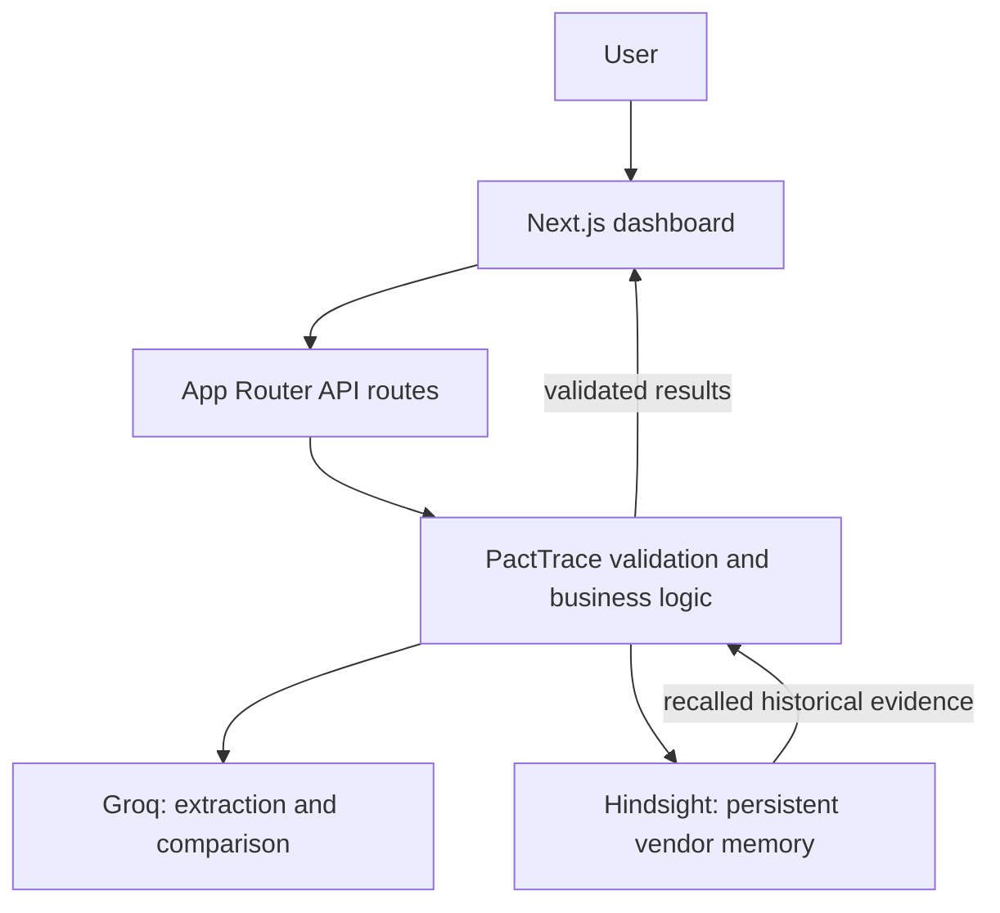

# PactTrace

**Every vendor promise. Remembered. Verified. Actionable.**

PactTrace creates persistent institutional vendor memory: capture a promise today, recall it during a later renewal, and compare the new quote against the actual historical evidence.

## Problem and solution

Companies lose vendor commitments across calls, emails, meeting notes, employees, and renewal cycles. A quote reviewed in isolation cannot explain whether a previously negotiated discount has disappeared.

PactTrace uses Groq to extract commitments and Hindsight to remember them beyond one browser session. Later, semantic recall supplies vendor-specific history for a conservative, evidence-backed comparison. The dashboard brings the promise, current evidence, condition, and recommended next action together.

## Capabilities

- Structured commitment extraction, including conditions, values, deadlines, and status.
- Hindsight retain of original interactions and individual commitments.
- Vendor-filtered semantic recall and a maximum of five selected memories per analysis.
- Quote comparisons: potential conflict, honored, or insufficient evidence.
- Exact evidence excerpt validation and conservative condition states.
- A session-based commitment ledger, memory timeline, and negotiation brief.
- Bounded provider retries, safe diagnostics, and an intentional demo seed CLI.

## Architecture



**Groq** supplies extraction and reasoning using `openai/gpt-oss-120b`. **Hindsight** supplies long-term agent memory through retain and recall. **PactTrace validation** checks request shapes, vendor attribution, response schemas, evidence excerpts, and status consistency. It does not convert a model assessment into a legal determination.

### Retain and recall

`POST /api/interactions` extracts commitments and sends a synchronous batch to Hindsight: the original interaction plus one natural-language memory per commitment. Metadata links each item to its vendor, source, and interaction. Retention is confirmed only when the complete batch is acknowledged.

`POST /api/analyze-quote` recalls facts using the new quote, rejects unlabelled or other-vendor results, and deduplicates repeated facts. The strongest subset, in Hindsight relevance order, is sent to Groq with original memory IDs. Returned evidence must exist in those memories and in the supplied quote.

## Before and after memory

Without historical memory, a renewal quote for 130 seats with no discount is just another quote. With Hindsight, PactTrace can recall a previous promise of a **15% renewal discount when the account exceeds 100 seats** and flag an evidence-backed potential conflict. This is a demonstration scenario, not a claim about a real vendor or customer.

## Stack

Next.js 16 App Router, React, TypeScript, Tailwind CSS, Zod, lucide-react, Groq SDK, and `@vectorize-io/hindsight-client`. GitHub hosts the repository; Vercel is the intended deployment platform. Supabase is not used by the implemented flow.

## Local setup

Use Node.js 24 LTS and the pnpm version declared in `package.json`.

```powershell
pnpm install --frozen-lockfile
pnpm dev
```

Create `.env.local` privately. Required variable names (values intentionally omitted):

```text
HINDSIGHT_BASE_URL
HINDSIGHT_BANK_ID
HINDSIGHT_API_KEY
GROQ_API_KEY
```

Use your provider dashboard to obtain credentials. Never place them in client code, screenshots, terminal transcripts, or source control. Restart the server after environment changes. The application defaults to a development bank if no bank ID is configured; explicitly select the bank for a release.

## Scripts and checks

| Command | Purpose |
| --- | --- |
| `pnpm dev` | Local development |
| `pnpm build` | Production compilation and framework type checks |
| `pnpm start` | Serve the production build |
| `pnpm lint` | ESLint |
| `pnpm exec tsc --noEmit` | Standalone TypeScript validation |
| `pnpm test` | Offline automated tests; no provider credentials required |
| `pnpm demo:seed` | Seed preview only; no writes |
| `pnpm demo:seed --confirm-bank=pacttrace-demo` | Intentionally seed the selected demo bank |

## API

| Route | Input / behavior |
| --- | --- |
| `GET /api/health` | App/configuration booleans only; no provider requests |
| `GET /api/hindsight-test` | Read-only recall connectivity probe; no seed writes |
| `POST /api/extract-commitment` | `vendor`, `interaction`; extraction only |
| `POST /api/interactions` | `vendor`, `interaction`, `source`; extract and retain |
| `POST /api/analyze-quote` | `vendor`, `quote`, `source`; recall and compare |

The historical diagnostic GET route is now read-only. Use the local CLI for seeding. This avoids duplicate writes from refreshes, crawlers, or monitoring.

## Intentional demo scenario

1. Manually configure the environment for a clean `pacttrace-demo` bank. Do not reset a bank containing real data.
2. Choose **one** preparation method: run the local seed CLI, or use **Extract & Remember** once in the dashboard. The CLI stores explicit fixtures; the dashboard demonstrates live Groq extraction.
3. Historical interaction: “CloudNova agreed to waive the onboarding fee and promised a 15% renewal discount if the account exceeds 100 seats.”
4. Analyze: “CloudNova renewal quote for 130 seats is ₹460000 annually. The quote does not include any renewal discount.”
5. Review the evidence, condition, timeline, and negotiation brief. Results are generated by the providers; no conflict is hardcoded.

For an isolated terminal session, manually select the demo bank before starting the app or seed command:

```powershell
$env:HINDSIGHT_BANK_ID = "pacttrace-demo"
pnpm demo:seed
pnpm demo:seed --confirm-bank=pacttrace-demo
```

The CLI uses stable document IDs and replace semantics for its three fixtures. It never clears unrelated records. Re-running can still incur provider processing cost. Page load and refresh never seed memories. The dashboard's session view resets on refresh; Hindsight history remains persistent.

## Safety, reliability, and limits

- Strict JSON schemas plus runtime Zod and exact evidence validation.
- Missing conditions become unknown; missing evidence is not proof of a violation.
- Financial impact remains `null`; a verified baseline/currency/term calculator is not implemented.
- Up to two provider retries per analysis across correction attempts, with one-second/two-second fallback backoff. Short `Retry-After` values are honored; cooldowns over five seconds fail safely instead of retrying too early. Selected transient 5xx responses are retryable. Ordinary 4xx responses are not.
- One separately bounded structured-output correction pass preserves the same validation rules.
- Unconfirmed retention may have partially succeeded. Check the bank before manually resubmitting.
- This is a single-bank demonstration application, **not a tenant-isolated production procurement system**. Vendor metadata is not user authentication. Use deployment access protection and gateway rate limits before exposing paid API routes; use only synthetic demo data until authentication, authorization, and tenant isolation exist.
- A green configuration check does not validate credentials. Test real provider connectivity after configuring Vercel and redeploying.

## Documentation and roadmap

- [Architecture](docs/architecture.md)
- [Three-minute demo](docs/demo-script.md)
- [Submission notes](docs/submission-notes.md)
- [Release checklist](docs/release-checklist.md)
- [Article draft](content/article-template.md), [LinkedIn draft](content/linkedin-template.md), [video script](content/video-script.md)

Future work: organization-scoped identity and bank isolation, durable idempotency for interactive writes, audit trails, tested numerical exposure calculations, stronger condition verification, and persistent multi-vendor UI state. Provider availability and correctness still require human review; no benchmarks or production-customer claims are implied.
