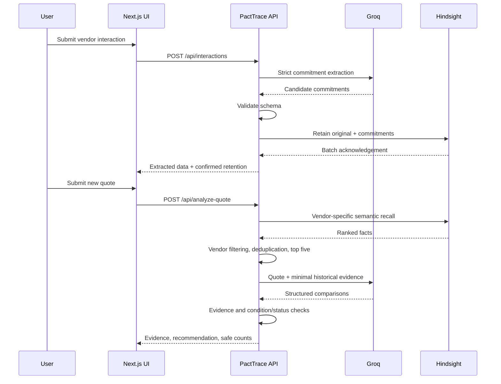

# Architecture and operational boundaries

PactTrace is a single-bank Next.js application. Browser state is transient; Hindsight is the persistent memory store. Groq produces candidate structured interpretations. PactTrace validates those interpretations before returning them.

## Modules

`commitments.ts` owns the extraction prompt/schema. `interaction-input.ts` validates request fields. `interaction-memory.ts` builds natural-language memory items and checks synchronous batch receipts. `vendor-memory.ts` rejects other-vendor/unlabelled facts, removes repeats and selects the top five in provider relevance order. `conflict-analysis.ts` owns comparison and exact evidence checks. `groq-retry.ts` shares one bounded retry budget across generation and correction. Route files handle HTTP validation and sanitized errors.

## Retention

Original interaction text is preserved inside a labelled memory. Commitments include description, value, condition, deadline when present, and status. Metadata includes vendor, source, memory type, commitment type, and interaction ID. The context is `vendor negotiation`. An empty extraction still stores the interaction. A partial or asynchronous receipt is not reported as confirmed synchronous retention. There is no claim of transaction rollback after a timeout.

The CLI seed uses three explicit demo fixtures with stable document IDs and replace semantics. It requires a confirmation flag and an explicitly selected `pacttrace-demo` bank. It probes the supported document-list endpoint, because the legacy bank profile endpoint was removed in Hindsight 0.10. It creates that bank only after a 404, not after authentication failures. It never wipes a bank.

## Recall and analysis

Recall asks for relevant vendor commitments, prices, discounts, conditions and negotiation history. Vendor metadata is authoritative for filtering; string mentions alone are insufficient. Conservative normalization removes repeats; changing numbers, negation or conditions is not treated as equivalent. Original IDs and text are preserved. The LLM receives only vendor, quote, and selected `{id,text}` facts.

`memoryCount` is the count returned by the vendor-filtered, deduplicated recall service. `memoriesUsed` is the selected subset, capped at five. `retryCount` counts provider retries, not the separate structured correction pass. A no-memory result does not call Groq.

Groq must return exact historical and quote excerpts. PactTrace rejects unknown memory IDs, invented excerpts, schema violations and inconsistent condition/status combinations. These checks establish provenance and consistency, not complete semantic truth: the model can still misinterpret evidence. Human review is required. Monetary calculations are deliberately absent and `financialImpact` remains null.

## Reliability and security

Server-only modules hold provider access. API responses never contain keys, environment dumps, raw provider errors or headers. The health route checks configuration presence only. The Hindsight diagnostic performs recall without writing and returns a count rather than memory content.

Groq retries 429 and selected transient 500/502/503/504 responses twice at most, sharing the budget across a correction pass. Numeric and HTTP-date Retry-After headers are supported. A requested delay above five seconds causes a safe failure rather than an early retry. SDK retries are disabled for these calls to prevent multiplication. Retain is not blindly retried by application code because a failed response may already have written data.

There is no user authentication, tenant authorization or distributed rate limiter in this repository. For a controlled demonstration, protect the deployment and API routes at the hosting/gateway layer and keep data synthetic. Before enterprise use, implement identity, tenant-specific bank selection, retention policy, audit logging, authorization tests, and durable idempotency. Do not claim the current shared-bank prototype isolates customers.

## Deployment

Vercel uses Next.js framework defaults; no custom infrastructure is required by the repository. Configure the four documented environment variables for the intended environment and redeploy. Presence checks cannot identify invalid credential formats. Provisioning, access protection, hosting limits and actual remote credential validity are manual release gates.
